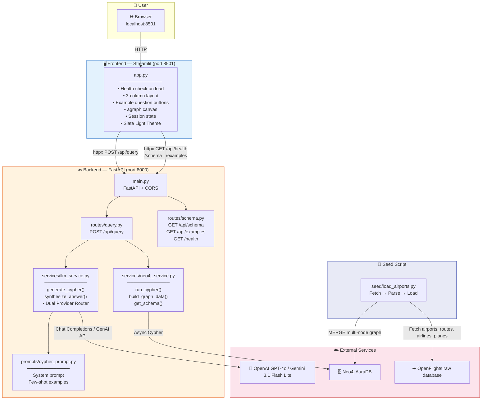
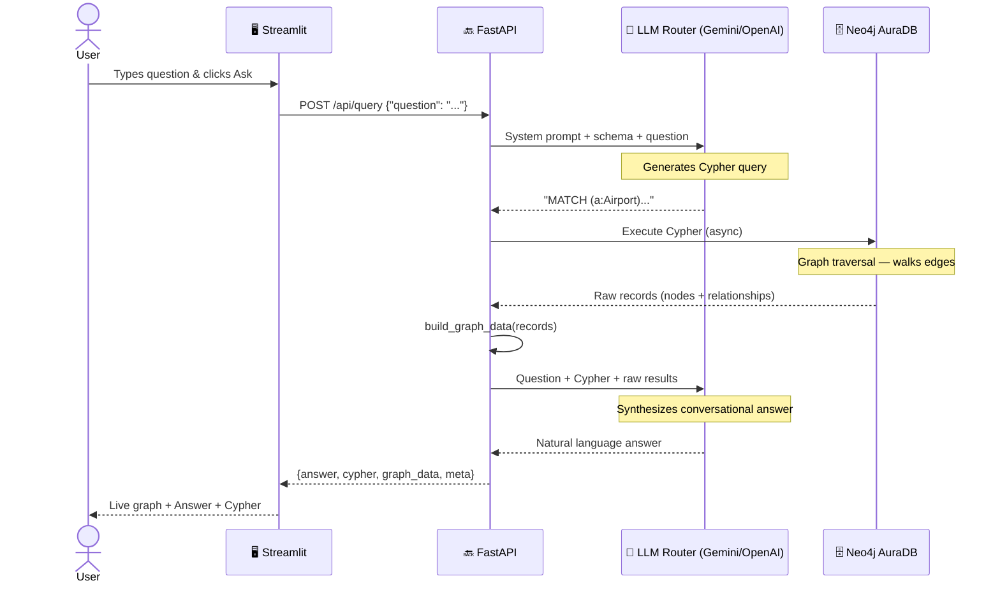
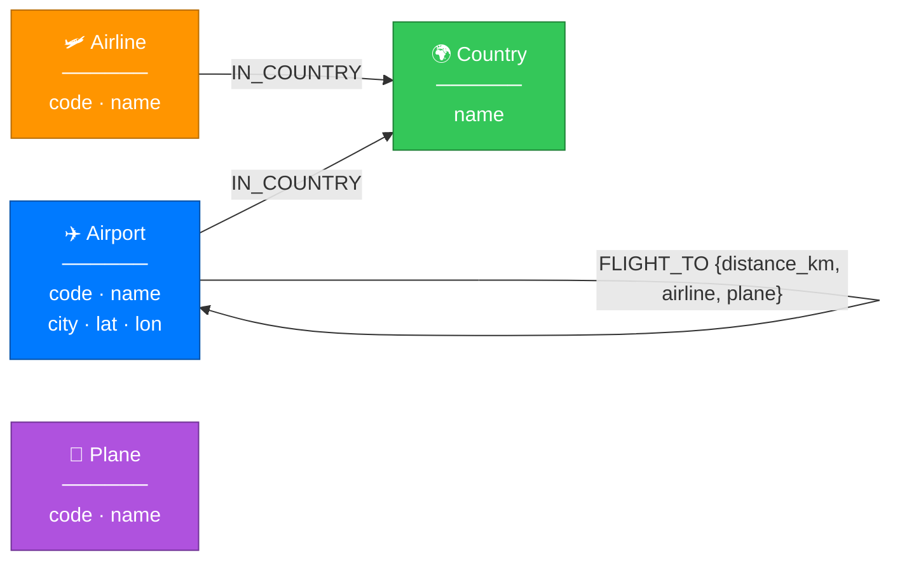

# ✈️ AirGraph — Multi-Node GraphRAG Aviation Demo

> **Prove that graph traversal beats vector RAG for complex routing and relationship-heavy aviation queries — visually, interactively, in real time.**

AirGraph is a demo application built on **OpenFlights aviation data** and **Neo4j AuraDB**. Ask a natural-language question, watch a force-directed graph animate on screen, read the generated Cypher query, and get an AI answer — all powered by graph traversal, zero embeddings.


---

## 🧠 What is GraphRAG?

Standard RAG splits documents into chunks, embeds them, and retrieves the most similar ones. It works well for *"What is the altitude of Delhi Airport?"* — but completely breaks down for relational and pathing questions like:

- *"Which airlines based in the United Arab Emirates operate flights to India?"* → requires set intersection connecting countries, airlines, and airports
- *"Find flight routes from Delhi to London with 1 layover, bypassing the Middle East"* → requires exclusion reasoning over transit countries
- *"What plane models and airlines are used on flights between Delhi and Singapore?"* → requires multi-node clustering and property joins

**No chunk size, no re-ranking strategy, no retrieval k can fix this.** The operations are structurally absent from the vector RAG paradigm. Graph traversal is the only answer.

---

## 🏗️ System Architecture



---

## 🔄 Request Flow



---

## 🗄️ Graph Schema



---

## ✨ Features

- 🔍 **Natural language → Cypher** — Generates high-performance Cypher queries automatically
- 🕸️ **Live graph visualization** — Colorful, animated force-directed subgraphs rendered for every query
- 💬 **Conversational answers** — Synthesizes complex transit details into comprehensive, reader-friendly flight summaries
- ⚡ **7 live example questions** — Ready-to-go templates spanning carriers, direct routes, countries, and planes
- 🎨 **Color-coded light theme UI** — Sleek Apple-style design system tailored for daytime visual clarity
- 🚀 **Dual Provider Dynamic Router** — Switch between Gemini 3.1 Flash Lite and OpenAI GPT-4o seamlessly inside `.env`

---

## 🛠️ Tech Stack

| Layer | Technology |
|---|---|
| 🔙 **Backend** | Python 3.11+, FastAPI |
| 🤖 **LLM** | OpenAI GPT-4o / Gemini 3.1 Flash Lite |
| 🗄️ **Graph DB** | Neo4j AuraDB (free tier) |
| 🖥️ **Frontend** | Streamlit |
| 📊 **Graph Viz** | streamlit-agraph |
| 🌐 **HTTP Client** | httpx |

> **100% Python.** No Node.js, no Docker, no npm. A single `pip install -r requirements.txt` installs everything.

---

## 📋 Prerequisites

Before you start, make sure you have:

| Requirement | Notes |
|---|---|
| 🐍 **Python 3.11+** | Check with `python3 --version` |
| ☁️ **Neo4j AuraDB account** | Free tier at [neo4j.com/cloud/aura](https://neo4j.com/cloud/aura/) — no local install needed |
| 🔑 **LLM Provider API key** | Gemini API key at [ai.google.dev](https://ai.google.dev/) or OpenAI key at [platform.openai.com](https://platform.openai.com/) |

---

## 🚀 Getting Started

### Step 1 — Clone & Install

```bash
cd airgraph
pip install -r requirements.txt
```

### Step 2 — Configure Credentials

Configure `.env` in `airgraph/` directory:

```bash
LLM_PROVIDER=gemini
GEMINI_API_KEY=your-gemini-api-key
NEO4J_URI=neo4j+s://xxxx.databases.neo4j.io
NEO4J_USERNAME=neo4j
NEO4J_PASSWORD=your-password
```

*(Alternatively, set `LLM_PROVIDER=openai` and specify `OPENAI_API_KEY`)*

### Step 3 — Seed the Database

```bash
python3 seed/load_airports.py
```

This fetches raw databases from OpenFlights, filters the aviation network around India + selective international hubs (safely keeping element counts well under free-tier limits), computes physical flight distances using the **Haversine formula**, and seeds the multi-node property graph in less than 30 seconds!

### Step 4 — Start the Backend

```bash
# Terminal 1
python3 -m uvicorn backend.main:app --reload
```

Backend runs at **http://localhost:8000**

### Step 5 — Start the Frontend

```bash
# Terminal 2
python3 -m streamlit run frontend/app.py
```

Open **http://localhost:8501** in your browser. 🎉

---

## 🗂️ Project Structure

```
airgraph/
│
├── 🔙 backend/
│   ├── main.py                  # FastAPI app · CORS · route registration
│   ├── config.py                # Pydantic Settings · Loads credentials
│   ├── models.py                # Pydantic request & response models
│   │
│   ├── routes/
│   │   ├── query.py             # POST /api/query — LLM router + Neo4j orchestration
│   │   └── schema.py            # GET /api/schema · /api/examples · /health
│   │
│   ├── services/
│   │   ├── neo4j_service.py     # Async Neo4j driver · Cypher execution · graph visualizer builder
│   │   ├── llm_service.py       # Dual provider router dispatch
│   │   ├── openai_service.py    # OpenAI chat synthesis interface
│   │   └── gemini_service.py    # Gemini GenAI chat synthesis interface
│   │
│   └── prompts/
│       └── cypher_prompt.py     # Schema prompts · few-shot aviation Cypher examples
│
├── 🖥️ frontend/
│   ├── app.py                   # Entire Streamlit UI in one file
│   └── .streamlit/
│       └── config.toml          # Light theme aesthetic override configuration
│
├── 🌱 seed/
│   └── load_airports.py         # Downloads OpenFlights data → builds & seeds multi-node Neo4j graph
│
├── requirements.txt             # All Python dependencies
└── README.md                    # This document
```

---

## 🎯 Demo Walkthrough

Click the sidebar example questions to see GraphRAG in action:

| # | Question | Why it needs graph traversal |
|---|---|---|
| 1️⃣ | *Show flights from Delhi (DEL) to London (LHR) operated by Air India (AI)* | Warmup — matches direct routes filtering for specific carrier codes. |
| 2️⃣ | *Which long-haul flights from Delhi (DEL) use the Boeing 777-300ER (77W)?* | 🌟 **Visually stunning** — branches out DEL to multiple airports along with the 77W Plane node! |
| 3️⃣ | *Find direct flight paths from India to Germany operated by Air India (AI)* | Multi-hop country matching: traces airport nodes, country nodes, and carrier node in one flow. |
| 4️⃣ | *Which airlines based in the United Arab Emirates fly to India?* | Traces Middle East airline headquarters and maps them to all destination airports inside India. |
| 5️⃣ | *What plane models and airlines are used on flights between Delhi (DEL) and Singapore (SIN)?* | Property joins and multi-node mapping showing airlines and plane clusters. |
| 6️⃣ | *Find flight routes from Delhi (DEL) to London (LHR) with 1 layover, bypassing the Middle East* | Exclusion reasoning — filters out countries inside the path (impossible for vector RAG). |
| 7️⃣ | *Find flight routes from Mumbai (BOM) to New York (JFK) with exactly 1 layover* | High-performance multi-path traversal mapping out optimal layovers (London, Frankfurt, Paris, Dubai). |

---

## ❓ Why Not Vector RAG?

Vector RAG retrieves text chunks by embedding similarity. It fails on relational queries because:

**🔗 Complex layovers (Q7):** A flight route with layovers represents a *directed path* across multiple independent flight legs. No text chunk contains this path. Retrieval by similarity gives you a list of independent flight tables, not a structured traversal route. Only a graph database can walk relationships to map paths dynamically.

**🚫 Logical exclusions (Q6):** Finding flights that bypass the Middle East requires computing paths and applying negative logical constraints on the country property of layover airports. It is a structural graph operation. It cannot be approximated by embeddings or vector similarities.

---

## 📡 API Endpoints

| Method | Path | Description |
|---|---|---|
| `GET` | `/api/health` | Liveness check |
| `GET` | `/api/schema` | Neo4j node labels, relationship types, property keys |
| `GET` | `/api/examples` | The 7 demo questions |
| `POST` | `/api/query` | Main endpoint: question → Cypher → answer + graph data |

---

*Built with ❤️ to show that for aviation routing and complex multi-node constraints, the graph wins.*
